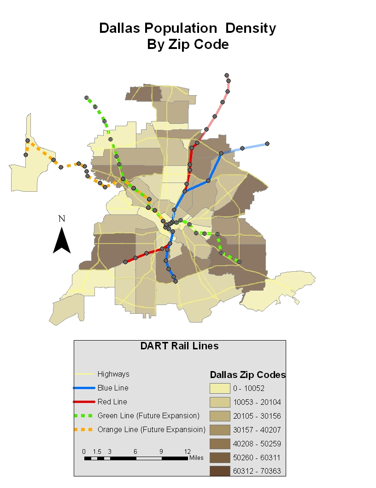
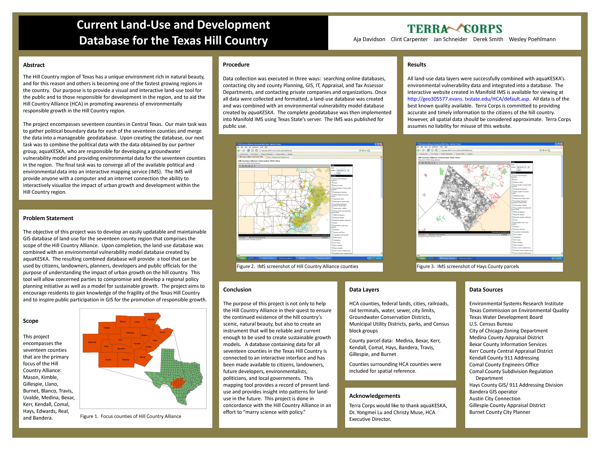

In 2008, at Texas State Univerity in San Marcos, Texas, I gave a presentation as part of a group for one of my final GIS courses. My role in the group, named _Terra Corps_, was as a GIS developer. Our objective was to create a geodatabase for an organization in Central Texas called [Hill Country Alliance](https://www.hillcountryalliance.org/). 

You can visit the Terra Corps website [here](http://sites.geo.txstate.edu/g4427/F07/g4427f07-03/index.html) for more information. 

Below are some examples of some of my GIS work. 

